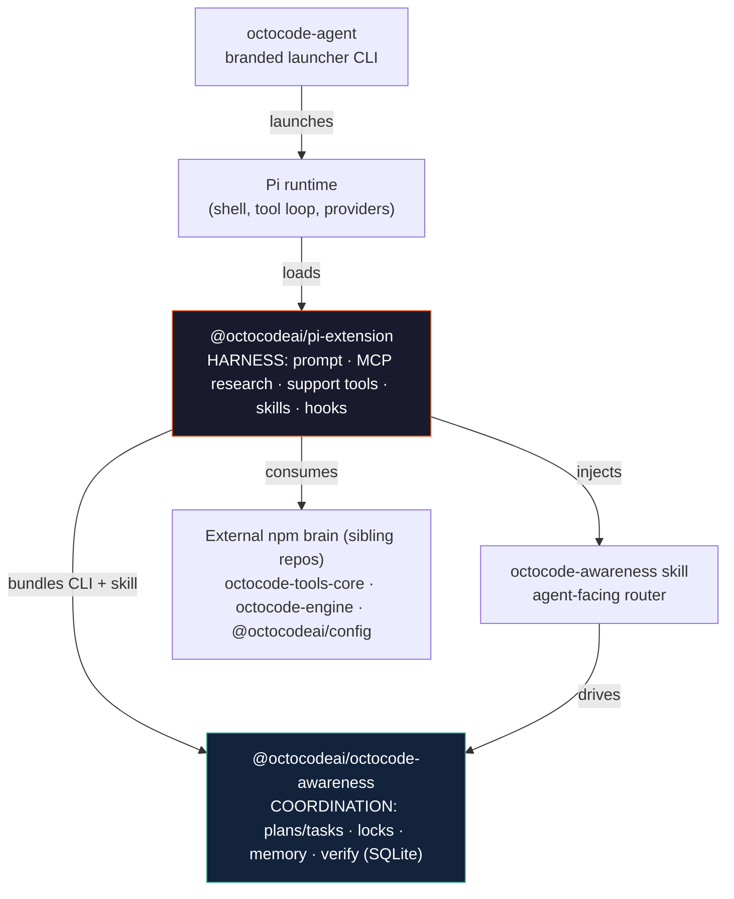

# Octocode Agent

<div align="center">
  

  **A self-working coding agent — the [Pi](https://github.com/earendil-works/pi) runtime driven by the Octocode harness, with always-on multi-agent coordination.**

  [](https://octocode.ai)
  

</div>

---

`octocode-agent` is the **agent slice** of the Octocode platform. It packages three layers that turn Pi into an evidence-first, coordinated coding agent:

1. **[`octocode-agent`](packages/octocode-agent)** — the branded launcher CLI. One command, one update path.
2. **[`@octocodeai/pi-extension`](packages/octocode-pi-extension)** — the **harness**: system prompt, MCP research bridge, support tools, skills, and Awareness wiring.
3. **[`@octocodeai/octocode-awareness`](packages/octocode-awareness)** — the **coordination layer**: a CLI + Agent Skill for shared plans, file awareness, locks, memory, and verification.

> **Pi edits, Octocode researches, Awareness coordinates.** The launcher is thin on purpose — all behavior lives in the harness and coordination packages.

---

## Table of Contents

- [Quick Start](#quick-start)
- [The Three Layers](#the-three-layers)
  - [1. octocode-agent — the launcher](#1-octocode-agent--the-launcher)
  - [2. Pi Extension — the harness](#2-pi-extension--the-harness)
  - [3. Awareness — CLI + Skill](#3-awareness--cli--skill)
- [Extending with MCP Servers and Skills](#extending-with-mcp-servers-and-skills)
- [Architecture](#architecture)
- [Repository Layout](#repository-layout)
- [Developing](#developing)
- [How the Pieces Wire Together](#how-the-pieces-wire-together)
- [Verified Capabilities](#verified-capabilities)
- [Documentation](#documentation)

---

## Quick Start

Run the agent — no clone required:

```bash
npm install -g octocode-agent
octocode-agent                 # launch the agent (Pi + Octocode harness)
octocode-agent --version       # launcher, core, and Pi host versions
octocode-agent update          # self-update the platform (pulls newest core)
octocode-agent update core     # update @octocodeai/pi-extension in place
```

Or use the harness inside an existing Pi install:

```bash
pi install npm:@octocodeai/pi-extension
/octocode                      # dashboard: status, agents, setup, skills, health
```

Authenticate GitHub-backed research once (optional, unlocks private repos + higher rate limits):

```bash
npx octocode auth login
npx octocode status
```

---

## The Three Layers

### 1. `octocode-agent` — the launcher

The branded entry point. It has a real dependency on `@octocodeai/pi-extension`, so
`npm install -g` and `npx` always resolve the pinned harness. It launches Pi in
**octocode-first mode** — the Octocode harness leads while Pi's runtime invariants
stay underneath.

```bash
octocode-agent [agent args...]   # launch; Pi-compatible args are mapped by the launcher
octocode-agent update            # self-update the platform
octocode-agent update core       # refresh only @octocodeai/pi-extension in this install
octocode-agent --agent-help      # launcher help (reserved subcommands only)
```

Because the prompt, skills, tools, and memory all live in the core package, nothing is
duplicated here — updating the core updates what the agent launches.

➡️ [`packages/octocode-agent`](packages/octocode-agent) · [PI_INTEGRATION.md](packages/octocode-agent/docs/PI_INTEGRATION.md)

### 2. Pi Extension — the harness

`@octocodeai/pi-extension` is where the agent gets its brain. Installing it into Pi loads:

| Surface | Count | What it is |
|---|---:|---|
| Octocode research tools via MCP | 13 | GitHub + local + LSP + npm evidence tools through the built-in `octocode` MCP server |
| Pi support tools | 9 | memory, agents, browser, web, MCP bridge |
| Replacement edit + write + bash | 3 | path-guarded file mutation + shell |
| Slash commands | 12 | `/octocode`, `/octocode-now`, `/octocode-tasks`, `/octocode-skills`, … |
| Bundled main-agent skills | 9 | research, awareness, subagent, rfc, eval, roast, … |

On load it sets `$OCTOCODE_CLI` and `$OCTOCODE_AWARENESS_CLI`, injects the operating-model
system prompt, registers edit-safety hooks, and wires Awareness lifecycle automation.

```text
$OCTOCODE_CLI            → node "$OCTOCODE_CLI" <command>
$OCTOCODE_AWARENESS_CLI  → node "$OCTOCODE_AWARENESS_CLI" <noun> <verb> --compact
```

> Awareness is deliberately **not** exposed as Pi tools. Agents drive it through the bundled
> CLI under the `octocode-awareness` skill; in-process hooks automate file presence,
> exclusive-conflict checks, briefings, and finish warnings — one CLI/schema contract, no
> duplication.

➡️ [`packages/octocode-pi-extension`](packages/octocode-pi-extension) · [docs](packages/octocode-pi-extension/docs/README.md) · [TOOLS](packages/octocode-pi-extension/docs/TOOLS.md) · [AWARENESS flow](packages/octocode-pi-extension/docs/AWARENESS_AGENT_FLOW.md)

### 3. Awareness — CLI + Skill

`@octocodeai/octocode-awareness` gives coding agents **shared situational awareness** that
chat history cannot reliably provide. It ships as two things that share one contract:

- **The Awareness CLI** (`out/octocode-awareness.js`) — the live-state engine over a local
  **SQLite** store (zero npm runtime deps, uses built-in `node:sqlite`, requires Node ≥ 22.13).
- **The `octocode-awareness` skill** — the agent-facing router that owns operating policy and
  points at the CLI for every action.

What it provides:

- a live **Plan → Task** queue with reasons, acceptance criteria, paths, and dependencies;
- **advisory file awareness** — who is editing what and why;
- optional **exclusive locks** for sensitive, non-mergeable changes;
- durable **memory**, agent-to-agent **signals**, **verification** receipts, and optional
  read-only `.octocode/` query exports;
- a **Homeostatic Awareness Loop** that senses coordination/verification/memory/token pressure
  and recommends one bounded correction.

```bash
AWARENESS_CLI="packages/octocode-awareness/out/octocode-awareness.js"

# orient before any repo work, then follow attend.next
node "$AWARENESS_CLI" attend --workspace "$PWD" --query "<task>" --compact

# core lifecycle
node "$AWARENESS_CLI" work start ...          # declare edited paths / claim a task
node "$AWARENESS_CLI" memory recall --smart   # surface prior verified learning
node "$AWARENESS_CLI" task submit ...
node "$AWARENESS_CLI" verify mark ... && node "$AWARENESS_CLI" verify audit
```

SQLite is canonical; `<workspace>/.octocode/` is a discovery shelf (authored plan docs +
requested query exports), never a second database. No server, no daemon.

➡️ [`packages/octocode-awareness`](packages/octocode-awareness) · [HOW_IT_WORKS](packages/octocode-awareness/docs/HOW_IT_WORKS.md) · [skill source](packages/octocode-awareness/skills/octocode-awareness)

---

## Extending with MCP Servers and Skills

Use **MCP servers** to expose more tools. Use **skills** to teach the agent a reusable workflow.
Most integrations only need MCP config — no code change, rebuild, or new skill.

MCP server config is read from:

| Scope | Path | Loaded when |
|---|---|---|
| Built-in | `npx -y octocode-mcp@latest` | always, as server `octocode` |
| Global | `~/.pi/agent/mcp.json` | if the file exists |
| Project | `<workspace>/.pi/agent/mcp.json` | only after the project is trusted |

Minimal config:

```json
{
  "mcpServers": {
    "my-server": {
      "command": "npx",
      "args": ["-y", "@acme/mcp-server@latest"],
      "env": {},
      "cwd": ".",
      "timeoutMs": 30000
    }
  }
}
```

Inside a session, the agent can also add a trusted server live:

```js
MCPTool({
  action: "add",
  server: "my-server",
  scope: "project",
  config: { command: "npx", args: ["-y", "@acme/mcp-server@latest"] }
})
```

Discovery is automatic: `MCPTool({ action: "list", server: "my-server" })` lists the
server's tools and schemas; `describe` reads one exact tool schema; `call` invokes it.
Config files are watched and hot-reloaded, so new tools apply on the next `MCPTool` call.
You can also inspect/manage servers from `/octocode-mcp` or `/mcp`.

Create or install a skill only when the integration needs operating guidance: when to use
the tools, how to combine them, validation rules, pitfalls, or a multi-step workflow. For
example, a docs-search MCP server can stand alone; a release-management workflow that uses
several tools and requires checks is a skill.

More detail: [`packages/octocode-pi-extension/docs/TOOLS.md#MCP-Servers`](packages/octocode-pi-extension/docs/TOOLS.md#mcp-servers) and [`packages/octocode-pi-extension/README.md`](packages/octocode-pi-extension/README.md).

---

## Architecture



**This repo ships the agent, harness, and coordination layers.** The tool-execution brain
(`@octocodeai/octocode-tools-core`, `@octocodeai/octocode-engine`, `@octocodeai/octocode-core`),
the config loader (`@octocodeai/config`), and the MCP / VS-Code interfaces are published from
sibling repos and consumed here as npm dependencies. Never duplicate `getOctocodeHome` or
`.env` parsing — always use `@octocodeai/config`.

---

## Repository Layout

Yarn 4 workspaces monorepo (`packages/*`), Node ≥ 20 (Awareness runtime needs ≥ 22.13).

| Package | npm name | Role | Deep dive |
|---|---|---|---|
| [`packages/octocode-agent`](packages/octocode-agent) | `octocode-agent` | Branded launcher — one command, one update path. | [docs](packages/octocode-agent/docs/README.md) |
| [`packages/octocode-pi-extension`](packages/octocode-pi-extension) | `@octocodeai/pi-extension` | The Pi harness: native tools, CLIs, system prompt, skills, Awareness wiring. | [docs](packages/octocode-pi-extension/docs/README.md) |
| [`packages/octocode-awareness`](packages/octocode-awareness) | `@octocodeai/octocode-awareness` | Shared coordination + memory/wiki/hooks/reflection (SQLite, zero runtime deps). Canonical skill source. | [docs](packages/octocode-awareness/docs/README.md) |

Agent guides: [`AGENTS.md`](AGENTS.md) (repo) · [`packages/octocode-awareness/AGENTS.md`](packages/octocode-awareness/AGENTS.md) (package). Internals: each package's `ARCHITECTURE.md` where present.

---

## Developing

```bash
yarn install

# root: fans out to every workspace
yarn build        # build all packages
yarn test         # run all test suites
yarn lint         # lint all
yarn typecheck    # typecheck all
```

Per-package verification (no root `verify`):

```bash
yarn workspace @octocodeai/octocode-awareness verify
yarn workspace @octocodeai/pi-extension verify
yarn workspace octocode-agent verify
```

Local end-to-end after changing a local package — **rebuild in dependency order**, then
exercise the real CLI / harness path (don't claim done from a compile alone):

```bash
yarn workspace @octocodeai/octocode-awareness build
yarn workspace @octocodeai/pi-extension build
yarn workspace octocode-agent build
```

**Conventions.** Plan → TDD → `yarn workspace <pkg> test` → `yarn lint` → verify. Coverage
target ≥ 90% branch (Vitest + v8). No backward-compat by default — refactor freely; add shims
only when asked.

**Build outputs (do not hand-edit):** `packages/octocode-awareness/out/**` (separate CLI +
import-only library/schema API + bundled skills), extension `dist/**`, and any
`.agents/skills/**` / `out/skills/**` mirrors. Edit source in `src/**`, `bin/**`, and the
canonical skill under `packages/octocode-awareness/skills/octocode-awareness/**`, then rebuild.

---

## How the Pieces Wire Together

1. `octocode-agent` launches **Pi** with `@octocodeai/pi-extension` loaded as the harness.
2. On load the extension sets `$OCTOCODE_CLI` + `$OCTOCODE_AWARENESS_CLI`, registers support
   tools, injects the operating-model system prompt, and installs edit-safety + Awareness
   lifecycle hooks.
3. For non-trivial repo work the agent activates the **`octocode-awareness` skill** and runs
   `attend`, then follows `attend.next` to claim work, declare edited files, coordinate with
   peers, record verified memory, and gate on verification.
4. Research runs through `MCPTool` and the built-in **`octocode` MCP server** (GitHub / local /
   LSP / npm), backed by the external Rust engine + tools-core packages.

**Config is a single source:** all env/config flows through `@octocodeai/config`
(`getOctocodeHome`, `propagateOctocodeEnv`, `parseEnv`, `loadOctocoderc`). Skills use the
injected `./octocode-config.mjs`; packages import from `@octocodeai/config` or a package-local
re-export.

---

## Verified Capabilities

Every surface below is exercised end-to-end (live smoke runs + the package test suites), not just compiled.

### Tools

| Surface | What's verified |
|---|---|
| `bash` / `edit` / `write` | Path-guarded shell, exact-match edits with audit diffs, guarded file writes |
| Octocode research (via MCP) | `localSearchCode` · `localViewStructure` · `localGetFileContent` · `localFindFiles` · `localFindDeadCode` · `npmSearch` · `ghSearchCode` · `ghViewRepoStructure` with `next.*` chaining |
| `lspGetSemantics` | Live LSP definitions/references/callers with exact file:line anchors |
| `web` | Search (provider fallback serper → duckduckgo), URL fetch with pagination |
| `chromeDebug` / `browserAgent` | Headless Chrome launch, all 28 CDP schemes implemented (contract-tested), task→scheme routing |
| Subagents | `spawnAgent` (lean workers, tool allowlists), `spawnSubagent` (typed specialists with auto-loaded skills), `AgentMessage` wait/send/steer/status/list/abort/kill, spawn-policy packet gate |
| Awareness | `attend`, verification gates (`verify audit`/`mark`), exclusive file locks with full contention cycle (acquire → conflict → release → re-acquire) |

### Skills

Bundled and installable skills (all with valid `SKILL.md` contracts): `octocode-awareness` (canonical source at repo-root [`skills/octocode-awareness`](skills/octocode-awareness), synced into the package at build), plus `octocode-research`, `octocode-brainstorming`, `octocode-eval`, `octocode-prompt-optimizer`, `octocode-rfc-generator`, `octocode-roast`, `octocode-skills`, `octocode-subagent`.

### Test surface

| Package | Suite |
|---|---|
| `@octocodeai/pi-extension` | 396 tests across 24 files (tools, prompts, schemes, subagents, security guards) |
| `@octocodeai/octocode-awareness` | 830 tests across 88 files + zero-dependency pack verification |

---

## Documentation

| Area | Links |
|---|---|
| Agent / launcher | [`octocode-agent` docs](packages/octocode-agent/docs/README.md) · [PI_INTEGRATION](packages/octocode-agent/docs/PI_INTEGRATION.md) |
| Harness (Pi extension) | [docs index](packages/octocode-pi-extension/docs/README.md) · [TOOLS](packages/octocode-pi-extension/docs/TOOLS.md) · [AWARENESS flow](packages/octocode-pi-extension/docs/AWARENESS_AGENT_FLOW.md) · [REFLECT](packages/octocode-pi-extension/docs/REFLECT.md) · [OVERRIDES](packages/octocode-pi-extension/docs/OVERRIDES.md) |
| Awareness | [docs index](packages/octocode-awareness/docs/README.md) · [HOW_IT_WORKS](packages/octocode-awareness/docs/HOW_IT_WORKS.md) · [HOOKS](packages/octocode-awareness/docs/HOOKS.md) · [VERIFY](packages/octocode-awareness/docs/VERIFY.md) · [LOCKS](packages/octocode-awareness/docs/LOCKS.md) · [MEMORY_NAVIGATION](packages/octocode-awareness/docs/MEMORY_NAVIGATION.md) |
| Platform | Website **[octocode.ai](https://octocode.ai)** · [Pi](https://github.com/earendil-works/pi) |

> The full Octocode platform — MCP server, the `octocode` CLI, the Rust engine, and the VS Code
> extension — lives in the sibling [`bgauryy/octocode`](https://github.com/bgauryy/octocode)
> monorepo and is consumed here as npm dependencies.

---

## License

MIT © [Guy Bary](https://octocode.ai) — see the `license` field in [`package.json`](package.json).
