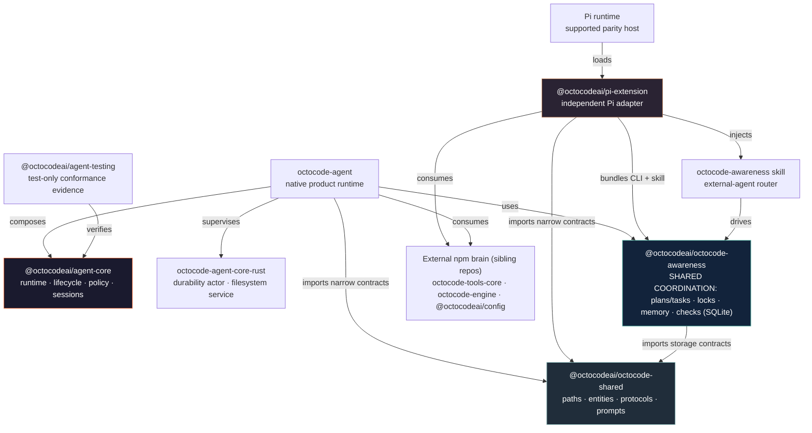

# Octocode Agent

<div align="center">
  

  **A native coding-agent editor with Octocode research, tools, and multi-agent coordination.**

  [](https://octocode.ai)
  

</div>

---

`octocode-agent` is the **agent slice** of the Octocode platform. It packages three layers around one native product runtime:

1. **[`octocode-agent`](packages/octocode-agent)** — the native editor and launcher. It composes `@octocodeai/agent-core`, native transports, sessions, settings, and OpenTUI.
2. **[`@octocodeai/pi-extension`](packages/octocode-pi-extension)** — the independently supported Pi adapter and cross-host conformance reference. Native agent/core and native release artifacts do not depend on it.
3. **[`@octocodeai/octocode-awareness`](https://github.com/bgauryy/octocode/tree/main/packages/octocode-awareness)** — the shared coordination, hooks, and memory runtime used by supported coding hosts.

> **The native editor runs the product loop.** The migration keeps Pi as a supported
> comparison toggle instead of a dependency or fallback of `octocode-agent`.

---

## Table of Contents

- [Quick Start](#quick-start)
- [The Three Layers](#the-three-layers)
  - [1. octocode-agent — the launcher](#1-octocode-agent--the-launcher)
  - [2. Pi Extension — the parity oracle](#2-pi-extension--the-parity-oracle)
  - [3. Awareness — CLI + Skill](#3-awareness--cli--skill)
- [Tool Ownership](#tool-ownership)
- [Terminal Experience](#terminal-experience)
- [Extending with MCP Servers and Skills](#extending-with-mcp-servers-and-skills)
- [Architecture](#architecture)
- [Architecture Audit Prompt](#architecture-audit-prompt)
- [Repository Layout](#repository-layout)
- [Developing](#developing)
- [How the Pieces Wire Together](#how-the-pieces-wire-together)
- [Verified Capabilities](#verified-capabilities)
- [Documentation](#documentation)

---

## Quick Start

Run the agent — no clone required:

```bash
npm install -g octocode-agent
octocode-agent                 # launch the native editor
octocode-agent --version       # launcher and native core version
octocode-agent update          # self-update the native product
```

Use the supported parity oracle inside an existing Pi install:

```bash
pi install npm:@octocodeai/pi-extension
/octocode                      # dashboard: status, agents, setup, skills, health
```

Authenticate GitHub-backed research once (optional, unlocks private repos + higher rate limits):

```bash
npx octocode auth login
npx octocode status
```

---

## The three product surfaces

### 1. `octocode-agent` — the launcher

The branded entry point composes the native `@octocodeai/agent-core` runtime directly.
It has no Pi dependency and does not embed, spawn, or fall back to Pi.

```bash
octocode-agent [agent args...]   # launch the native editor
octocode-agent update            # self-update the platform
octocode-agent --help            # native launcher help
```

The launcher composes the shared prompt, tool catalog, MCP and Skill facades, sessions,
settings, and Awareness adapter through native package boundaries.

➡️ [`packages/octocode-agent`](packages/octocode-agent) · [historical Pi comparison](packages/octocode-agent/docs/PI_INTEGRATION.md)

### 2. Pi Extension — the parity oracle

`@octocodeai/pi-extension` is the supported Pi-host adapter used for compatibility and
native-parity comparisons during migration. Installing it into Pi loads:

| Surface | Count | What it is |
|---|---:|---|
| Octocode research tools via MCP | 13 | GitHub + local + LSP + npm evidence tools through the built-in `octocode` MCP server |
| Direct model tools | 17 | Guarded `bash` plus `file`, `web`, `chromeDebug`, `agent`, `callTool`, `skill`, `plan`, `localServer`, `MCPTool`, `askUser`, `memory`, `lock`, `message`, `readMedia`, `media`, and `runFfmpeg` |
| Bundled skill | 1 | `octocode-awareness`; the rest install on demand via `npx octocode skill --add` |

On load it sets `$OCTOCODE_CLI` and `$OCTOCODE_AWARENESS_CLI`, injects the operating-model
system prompt, registers edit-safety hooks, arms the session-scoped approval gate, and wires
Awareness lifecycle automation. The full TUI layer it adds — banner, footer cockpit,
permission levels, an RFC-backed plan gate + a live HTML plan/RFC page — is summarized in
[Terminal Experience](#terminal-experience).

```text
$OCTOCODE_CLI            → node "$OCTOCODE_CLI" <command>
$OCTOCODE_AWARENESS_CLI  → node "$OCTOCODE_AWARENESS_CLI" <noun> <verb> --compact
```

> Awareness is deliberately **not** exposed as Pi tools. Agents drive it through the bundled
> CLI under the `octocode-awareness` skill; in-process hooks automate file presence,
> exclusive-conflict checks, briefings, and finish warnings — one CLI/schema contract, no
> duplication.

➡️ [`packages/octocode-pi-extension`](packages/octocode-pi-extension) · [docs](packages/octocode-pi-extension/docs/README.md) · [TOOLS](packages/octocode-pi-extension/docs/TOOLS.md) · [AWARENESS flow](packages/octocode-pi-extension/docs/AWARENESS_AGENT_FLOW.md)

### 3. Awareness — CLI + Skill

`@octocodeai/octocode-awareness` gives any coding host one shared coordination contract:

- **The shared library** (`@octocodeai/octocode-awareness`) used in-process by Pi.
- **The shared CLI bin** (`out/octocode-awareness.js`, exposed at runtime as `$OCTOCODE_AWARENESS_CLI`) —
  the live-state engine over a local **SQLite** store (zero npm runtime deps, uses built-in
  `node:sqlite`, requires Node ≥ 22.13).
- **The `octocode-awareness` skill** — the external-agent router that points at the shared bin.

What it provides:

- a live **Plan → Task** queue with reasons, acceptance criteria, paths, and dependencies;
- **advisory file presence** — who is editing what and why;
- optional **exclusive locks** for sensitive, non-mergeable changes;
- durable **memory**, agent-to-agent **messages**, **verification** receipts, and an agent
  registry with presence counts.

```bash
# orient before any repo work (the extension sets $OCTOCODE_AWARENESS_CLI at load)
node "$OCTOCODE_AWARENESS_CLI" status --workspace "$PWD"

# core lifecycle
node "$OCTOCODE_AWARENESS_CLI" work start ...          # declare edited paths
node "$OCTOCODE_AWARENESS_CLI" task claim ...          # claim a ready task
node "$OCTOCODE_AWARENESS_CLI" memory recall ...       # surface prior verified learning
node "$OCTOCODE_AWARENESS_CLI" check mark ... && node "$OCTOCODE_AWARENESS_CLI" check audit
```

Commands: `status · plan · task · lock · work · handoff · agent · message · check · memory · hooks`
(run `… schema` for exact shapes). SQLite is canonical; `<workspace>/.octocode/` is a discovery
shelf (authored plan docs), never a second database. No server, no daemon.

The same root `octocode-awareness` binary adds attend, reflection, projections, sessions,
and maintenance over the configured Awareness database. Hosts use the same command and schema
contracts instead of maintaining a second coordination ledger.

➡️ [`@octocodeai/octocode-awareness`](https://github.com/bgauryy/octocode/tree/main/packages/octocode-awareness) · [HOW_IT_WORKS](https://github.com/bgauryy/octocode/tree/main/packages/octocode-awareness/docs/HOW_IT_WORKS.md)

---

## Tool Ownership

The native launcher obtains live Octocode tool schemas and applies native runtime policy.
The Pi parity table documents the oracle's replacement routes; it is not the native
launcher's tool-registration path.

| Pi native tool | Octocode route |
|---|---|
| `read` | `MCPTool` → `localGetFileContent`; local media uses `readMedia` |
| `edit`, `write` | `file` with `type:"edit"`, `"write"`, or `"delete"` |
| `grep`, `find`, `ls` | `MCPTool` → `localSearch` with `text`, `files`, or `tree` |
| `bash` | Octocode's guarded same-name `bash` tool |

Pi users who install the extension get the effective palette below: the extension
removes replaced native names on load and again at session start as a defensive backstop.
See [OVERRIDES.md](packages/octocode-pi-extension/docs/OVERRIDES.md) for the exact contract.

---

## Terminal Experience

The following surfaces describe the Pi parity oracle. The native product uses the OpenTUI
adapter under `packages/octocode-agent/src/terminal/`.

The Pi adapter ships a deliberate TUI design system — one palette, one copy source, and motion
that always *means* something:

| Surface | What you get |
|---|---|
| **Startup banner** | Branded OCTOCODE card (lens + octopus emblem, white→purple gradient with an animated gloss sweep) rendered once per fresh session as a transcript entry — zero prompt-token cost, re-renders on `/resume`. |
| **Footer cockpit** | Context gauge · merged turn timing (`turn 8 · 14s` live, `turns 7 · last 12s` idle) · session uptime · workers/awareness/peer state · effort dial · **always-visible permission mode** · prompt overhead · `branch* ΔN` changed files. `/octocode-footer legend` explains every segment; `compact`/`default`/`full` tune density. |
| **Motion language** | *Wave* (footer wordmark ripples) = working · *glow* (breathing ⚠ ✗ ✉ and a ≥90% context gauge) = act on me · *gloss sweep* = brand splash. Deterministic, timer-free, test-pinned so status colors can never become decoration. |
| **Approval gate** | Sensitive bash (installs, git mutation, deletes, sudo, publish, system/infra, shell-rc persistence, backtick/`$()` evasion) prompts Yes / No / Always-allow. Session-scoped levels — `strict` / `default` / `relaxed` — via `/octocode-permissions`, a cycle shortcut (default `ctrl+shift+a`), or `OCTOCODE_PERMISSION_LEVEL`. Everything resets on a new session; headless hosts always deny rather than assume consent. |
| **Plan workflow** | A gated **research → RFC → approve** flow. `/octocode-plan new <goal>` enters **plan mode** (write tools blocked until approval); the agent orients, then `plan action:clarify` runs a bounded ≤3-question interview whose answers land in a durable **decision log**. Consequential work routes through the `octocode-rfc-generator` skill — and `plan action:propose` **blocks** a consequential plan that has no RFC. Propose sets the checklist *and* asks for sign-off inline (Approve / Reject; free-text = change request, echoed verbatim). `/octocode-plan html` opens a **live local page** — phase timeline, status checklist, mermaid dependency diagram, the **rendered RFC**, the decision log, and a shareable `plan.md` — rewriting on every change while you keep talking in the terminal. |
| **Widgets** | Unified below-editor status panel (model → plan → awareness → agents) with a live **phase stepper** (Research → RFC → Approve → Build → Verify), card-styled `askUser` prompts (72-col frame, quiet chrome, recommended-default + pros/cons), filter-preserving select overlays, worker inbox, command palette (default `ctrl+shift+k`). |

All copy lives in one content module and all design constants (palette tokens, separators,
brand marks, wave/glow painters) in one design module — wording and colors cannot drift
between surfaces, and the test suite pins the rules (for example, only warning/error states may glow).

---

## Extend with MCP servers and skills

Use **MCP servers** to expose more tools. Use **skills** to teach the agent a reusable workflow.
Most integrations only need MCP config — no code change, rebuild, or new skill.

The native launcher discovers Octocode-managed configuration at both scopes.
`$OCTOCODE_HOME` is normally `~/.octocode`.

| Scope | Models | MCP servers | Skills |
|---|---|---|---|
| Global | `$OCTOCODE_HOME/agent/models.json` | `$OCTOCODE_HOME/agent/mcp/servers.json` | `$OCTOCODE_HOME/agent/skills/` |
| Workspace | `$OCTOCODE_HOME/agent/workspaces/<workspace-key>/models.json` | `$OCTOCODE_HOME/agent/workspaces/<workspace-key>/mcp/servers.json` | `$OCTOCODE_HOME/agent/workspaces/<workspace-key>/skills/` |

Run `octocode-agent setup --fix --scope project` to initialize the current
repository or `octocode-agent setup --fix --scope all` to initialize both
scopes. The default scope is global.

MCP server config is read from:

| Scope | Paths in precedence order | Loaded when |
|---|---|---|
| Built-in | pinned local `octocode-mcp` (`npx -y octocode-mcp@latest` fallback) | Always, as server `octocode` |
| Global | `$OCTOCODE_HOME/agent/mcp/servers.json`; vendor user files | Managed source is active; vendor imports are disabled by default |
| Workspace | `$OCTOCODE_HOME/agent/workspaces/<workspace-key>/mcp/servers.json`; vendor workspace files | Managed source requires workspace trust; vendor imports are disabled by default |

A later active definition of the same server name wins. Claude Code, Cursor,
Codex, `.agent`, and `.agents` files are
read-only discovery imports. They are disabled by default and can be enabled
explicitly from `/settings` without copying or editing the owning file.

Skill discovery checks `.pi/skills`, `.pi/agent/skills`, `.claude/skills`,
`.cursor/skills`, `.codex/skills`, `.agent/skills`, and `.agents/skills` under
both the home and workspace hierarchy. Compatibility Skills are disabled
by default and are enabled by exact source, so duplicate names remain independent.

Minimal config:

```json
{
  "mcpServers": {
    "my-server": {
      "command": "npx",
      "args": ["-y", "@acme/mcp-server@latest"],
      "env": {},
      "cwd": ".",
      "timeoutMs": 30000
    }
  }
}
```

Inside a session, the agent can also add a trusted server live:

```js
MCPTool({queries:[{
  reasoning: "Add the trusted external server.",
  action: "add",
  server: "my-server",
  scope: "project",
  config: { command: "npx", args: ["-y", "@acme/mcp-server@latest"] }
}]})
```

Discovery is automatic: `MCPTool({queries:[{reasoning:"Inspect the server tools.",
action:"list",server:"my-server"}]})` lists the server's tools and schemas; `describe`
reads one exact tool schema; `call` invokes it. Config files are watched and hot-reloaded,
so new tools apply on the next `MCPTool` call. You can also inspect or manage servers from
`/octocode-mcp`.

Create or install a skill only when the integration needs operating guidance: when to use
the tools, how to combine them, validation rules, pitfalls, or a multi-step workflow. For
example, a docs-search MCP server can stand alone; a release-management workflow that uses
several tools and requires checks is a skill.

More detail: [`packages/octocode-pi-extension/docs/TOOLS.md#MCP-Servers`](packages/octocode-pi-extension/docs/TOOLS.md#mcp-servers) and [`packages/octocode-pi-extension/README.md`](packages/octocode-pi-extension/README.md).

---

## Architecture


```mermaid
graph TD
    AGENT["octocode-agent<br/>native product runtime"]
    CORE["@octocodeai/agent-core<br/>runtime · lifecycle · policy · sessions"]
    RUST["octocode-agent-core-rust<br/>durability actor · filesystem service"]
    TEST["@octocodeai/agent-testing<br/>test-only conformance evidence"]
    SHARED["@octocodeai/octocode-shared<br/>paths · entities · protocols · prompts"]
    PI["Pi runtime<br/>supported parity host"]
    EXT["@octocodeai/pi-extension<br/>independent Pi adapter"]
    AW["@octocodeai/octocode-awareness<br/>SHARED COORDINATION: plans/tasks · locks · memory · checks (SQLite)"]
    SKILL["octocode-awareness skill<br/>external-agent router"]
    BRAIN["External npm brain (sibling repos)<br/>octocode-tools-core · octocode-engine · @octocodeai/config"]

    AGENT -- composes --> CORE
    AGENT -- supervises --> RUST
    TEST -- verifies --> CORE
    AGENT -- imports narrow contracts --> SHARED
    AGENT -- uses --> AW
    PI -- loads --> EXT
    EXT -- bundles CLI + skill --> AW
    EXT -- injects --> SKILL
    SKILL -- drives --> AW
    EXT -- consumes --> BRAIN
    EXT -- imports narrow contracts --> SHARED
    AW -- imports storage contracts --> SHARED
    AGENT -- consumes --> BRAIN

    style CORE fill:#1a1a2e,stroke:#e75d2a,color:#fff
    style SHARED fill:#202d3a,stroke:#7aa,color:#fff
    style EXT fill:#2a2333,stroke:#b87850,color:#fff
    style AW fill:#12233b,stroke:#4a9,color:#fff
```

**This repo ships the agent, harness, and coordination layers.** The tool-execution brain
(`@octocodeai/octocode-tools-core`, `@octocodeai/octocode-engine`, `@octocodeai/octocode-core`),
the config loader (`@octocodeai/config`), and the MCP / VS-Code interfaces are published from
sibling repos and consumed here as npm dependencies. Never duplicate `getOctocodeHome` or
`.env` parsing — always use `@octocodeai/config`.

The native interactive flow is deliberately layered: core emits versioned runtime
events; `native-runtime-presentation.ts` translates them; the interactive
controller owns input and teardown; `presentation/contracts.ts` defines the
renderer-neutral interface; and `terminal/opentui/` owns toolkit state and
rendering. See the [native module map](packages/octocode-agent/ARCHITECTURE.md)
and [completion ledger](DESIGN/LEFTOVERS.md).

---

## Architecture audit prompt

Use [`prompts/architecture.md`](prompts/architecture.md) when asking a coding agent to review
the native `octocode-agent` CLI implementation end-to-end. The prompt requires the reviewer
to reconcile documented design with runtime behavior, trace every supported execution mode,
prove findings with Octocode AST/LSP evidence, follow TDD for changes, and verify the rebuilt
CLI rather than treating compilation alone as completion.

The prompt supplements the repository and package agent guides; [`AGENTS.md`](AGENTS.md) and
any applicable package-specific instructions remain authoritative.

---

## Repository Layout

Yarn 4 workspaces monorepo (`packages/*`), Node ≥ 26.4 for root development and the native CLI.

| Package | npm name | Role | Deep dive |
|---|---|---|---|
| [`packages/octocode-agent-core`](packages/octocode-agent-core) | `@octocodeai/agent-core` | Host-neutral runtime contracts and semantic kernel. | [architecture](packages/octocode-agent-core/ARCHITECTURE.md) |
| [`packages/octocode-agent-core-rust`](packages/octocode-agent-core-rust) | native binaries | SQLite durability actor and capability-rooted filesystem service. | [architecture](packages/octocode-agent-core-rust/ARCHITECTURE.md) |
| [`packages/octocode-agent-testing`](packages/octocode-agent-testing) | `@octocodeai/agent-testing` | Deterministic host mocks and cross-host conformance evidence. | [architecture](packages/octocode-agent-testing/ARCHITECTURE.md) |
| [`packages/octocode-agent`](packages/octocode-agent) | `octocode-agent` | Native editor, transports, sessions, settings, and OpenTUI adapter. | [architecture](packages/octocode-agent/ARCHITECTURE.md) · [docs](packages/octocode-agent/docs/README.md) |
| [`packages/octocode-pi-extension`](packages/octocode-pi-extension) | `@octocodeai/pi-extension` | Independently supported Pi adapter and conformance reference. | [architecture](packages/octocode-pi-extension/ARCHITECTURE.md) · [docs](packages/octocode-pi-extension/docs/README.md) |
| [`@octocodeai/octocode-awareness`](https://github.com/bgauryy/octocode/tree/main/packages/octocode-awareness) | `@octocodeai/octocode-awareness` | SQLite coordination, memory, hooks, reflection, and recovery. | [architecture](https://github.com/bgauryy/octocode/tree/main/packages/octocode-awareness/ARCHITECTURE.md) · [docs](https://github.com/bgauryy/octocode/tree/main/packages/octocode-awareness/docs/README.md) |
| [`packages/octocode-shared`](packages/octocode-shared) | `@octocodeai/octocode-shared` | Shared paths, entities, protocols, database control data, discovery, and prompts. | [architecture](packages/octocode-shared/ARCHITECTURE.md) |

Agent guides: [`AGENTS.md`](AGENTS.md) (repo) · [Awareness package guide](https://github.com/bgauryy/octocode/tree/main/packages/octocode-awareness/AGENTS.md). Internals: each package's `ARCHITECTURE.md` where present.

---

## Developing

```bash
yarn install

# root: fans out to every workspace
yarn build        # build all packages
yarn test         # run all test suites
yarn lint         # lint all
yarn typecheck    # typecheck all
yarn verify       # full integration/release gate, including pack, PTY, and performance checks
```

For focused development, per-package verification remains available:

```bash
yarn workspace @octocodeai/pi-extension verify
yarn workspace octocode-agent verify
```

Local end-to-end after changing a local package — **rebuild in dependency order**, then
exercise the real CLI / harness path (don't claim done from a compile alone):

```bash
yarn workspace @octocodeai/pi-extension build
yarn workspace octocode-agent build
```

**Conventions.** Plan → TDD → `yarn workspace <pkg> test` → `yarn lint` → verify. Coverage
target ≥ 90% branch (Vitest + v8). No backward-compat by default — refactor freely; add shims
only when asked.

**Build outputs (do not hand-edit):** extension `dist/**`, and any `.agents/skills/**` /
`out/skills/**` mirrors. Awareness output and its canonical skill live in the sibling
[`bgauryy/octocode` repository](https://github.com/bgauryy/octocode/tree/main/packages/octocode-awareness).

---

## How the pieces wire together

1. `octocode-agent` composes `@octocodeai/agent-core`, native model/tool adapters, sessions,
   transports, and OpenTUI without importing Pi.
2. The separate Pi parity path loads `@octocodeai/pi-extension`. On load, the extension sets
   `$OCTOCODE_CLI` + `$OCTOCODE_AWARENESS_CLI`, registers support
   tools, injects the operating-model system prompt, and installs edit-safety + Awareness
   lifecycle hooks.
3. For non-trivial repository work the agent activates the **`octocode-awareness` skill**
   and runs `status`, then claims work, declares edited files, coordinates with peers, records
   verified memory, and gates on verification.
4. Research runs through `MCPTool` and the built-in **`octocode` MCP server** (GitHub / local /
   LSP / npm), backed by the external Rust engine + tools-core packages.

**Config is a single source:** all env/config flows through `@octocodeai/config`
(`getOctocodeHome`, `propagateOctocodeEnv`, `parseEnv`, `loadOctocoderc`). Skills use the
injected `./octocode-config.mjs`; packages import from `@octocodeai/config` or a package-local
re-export.

---

## Verified Capabilities

The surfaces below are the retained Pi-oracle baseline exercised by its package tests and
smoke paths. They are comparison inputs, not evidence that the native cutover gates pass.
Native headless behavior and remaining limits are documented in
[`HEADLESS.md`](packages/octocode-agent/docs/HEADLESS.md).

### Tools

| Surface | What's verified |
|---|---|
| `bash` / `file` | Path-guarded shell plus preflighted edit/write/delete batches with stale/lost-update checks and diffs |
| Octocode research (via MCP) | `localSearch` · `localGetFileContent` · `localAnalyzeGraph` · `npmSearch` · `ghSearch` with `next.*` chaining |
| `lspGetSemantics` | Live LSP definitions/references/callers with exact file:line anchors |
| `web` | Search (provider chain Tavily → Serper → Exa → DuckDuckGo), URL fetch with pagination |
| `readMedia` / `media` | Perceives images, video, and audio; authors images/PDFs and transforms media through a separate write boundary |
| `runFfmpeg` | Runs advanced `ffmpeg` or `ffprobe` arguments with declared, workspace-contained paths, progress, cancellation, and bounded output |
| `chromeDebug` / `agent` | Direct CDP operations plus browser-profile routing and multi-turn worker lifecycle |
| `agent` | Typed/custom/browser worker spawn plus inspect/wait/message/steer/abort/kill lifecycle operations |
| Awareness (Lite) | `status`, plan/task queue, verification gates (`verify audit`/`mark`), exclusive file locks with the full contention cycle (acquire → conflict → release → re-acquire), agent presence counts |

### Skills

The native prompt includes the canonical Awareness coordination fragment. The Pi adapter
injects equivalent host-specific instructions for parity. External agents can install
`octocode-awareness` from the package-owned source
[`packages/octocode-awareness/skills/octocode-awareness`](https://github.com/bgauryy/octocode/tree/main/packages/octocode-awareness/skills/octocode-awareness).
The published Awareness CLI includes the skill, references, and standalone runners. Other workflow skills remain
installable with `npx octocode skill --add`.

### Test surface

| Package | Suite |
|---|---|
| `@octocodeai/pi-extension` | Vitest suites for tools, prompts, CDP schemes, subagents, approval gates, terminal widgets, and the plan/RFC surface. Exact counts come from the current test run. |
| `@octocodeai/octocode-awareness` | Shared SQLite coordination/library/CLI tests, advanced runtime tests, and zero-dependency pack verification |

---

## Documentation

| Area | Links |
|---|---|
| Agent / launcher | [`octocode-agent` docs](packages/octocode-agent/docs/README.md) · [PI_INTEGRATION](packages/octocode-agent/docs/PI_INTEGRATION.md) |
| Architecture and flows | [Core](packages/octocode-agent-core/ARCHITECTURE.md) · [native](packages/octocode-agent/ARCHITECTURE.md) · [Rust services](packages/octocode-agent-core-rust/ARCHITECTURE.md) · [completion ledger](DESIGN/LEFTOVERS.md) |
| Architecture audit | [Native CLI implementation review prompt](prompts/architecture.md) |
| Documentation quality | [Documentation audit and ratings](docs/DOCUMENTATION_AUDIT.md) |
| Harness (Pi extension) | [docs index](packages/octocode-pi-extension/docs/README.md) · [TOOLS](packages/octocode-pi-extension/docs/TOOLS.md) · [AWARENESS flow](packages/octocode-pi-extension/docs/AWARENESS_AGENT_FLOW.md) · [REFLECT](packages/octocode-pi-extension/docs/REFLECT.md) · [OVERRIDES](packages/octocode-pi-extension/docs/OVERRIDES.md) |
| Awareness | [docs index](https://github.com/bgauryy/octocode/tree/main/packages/octocode-awareness/docs/README.md) · [HOW_IT_WORKS](https://github.com/bgauryy/octocode/tree/main/packages/octocode-awareness/docs/HOW_IT_WORKS.md) · [HOOKS](https://github.com/bgauryy/octocode/tree/main/packages/octocode-awareness/docs/HOOKS.md) · [VERIFY](https://github.com/bgauryy/octocode/tree/main/packages/octocode-awareness/docs/VERIFY.md) · [LOCKS](https://github.com/bgauryy/octocode/tree/main/packages/octocode-awareness/docs/LOCKS.md) · [MEMORY_NAVIGATION](https://github.com/bgauryy/octocode/tree/main/packages/octocode-awareness/docs/MEMORY_NAVIGATION.md) |
| Platform | Website **[octocode.ai](https://octocode.ai)** · [Pi](https://github.com/earendil-works/pi) |

> The full Octocode platform — MCP server, the `octocode` CLI, the Rust engine, and the VS Code
> extension — lives in the sibling [`bgauryy/octocode`](https://github.com/bgauryy/octocode)
> monorepo and is consumed here as npm dependencies.

---

## License

MIT © [Guy Bary](https://octocode.ai) — see the `license` field in [`package.json`](package.json).
