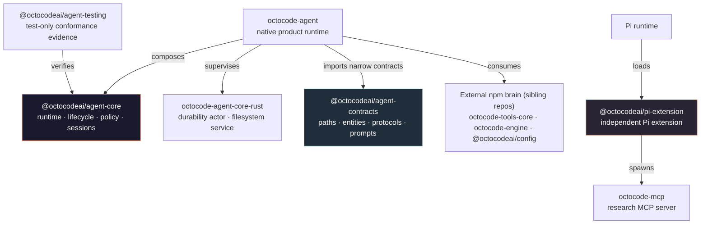

# Octocode Agent

<div align="center">
  

  **A native coding-agent editor with Octocode research, tools, and multi-agent coordination.**

  [](https://octocode.ai)
  

</div>

---

`octocode-agent` is the **agent slice** of the Octocode platform. It packages two layers around one native product runtime:

1. **[`octocode-agent`](packages/octocode-agent)** — the native editor and launcher. It composes `@octocodeai/agent-core`, native transports, sessions, settings, and OpenTUI.
2. **[`@octocodeai/pi-extension`](packages/octocode-pi-extension)** — a small, independently supported [Pi](https://pi.dev) extension. Native agent/core and native release artifacts do not depend on it.

> **The native editor runs the product loop.** The Pi extension is a separate product,
> not a dependency or fallback of `octocode-agent`.

---

## Table of Contents

- [Quick Start](#quick-start)
- [The Two Product Surfaces](#the-two-product-surfaces)
  - [1. octocode-agent — the launcher](#1-octocode-agent--the-launcher)
  - [2. Pi Extension](#2-pi-extension)
- [Tool Ownership](#tool-ownership)
- [Extending with MCP Servers and Skills](#extending-with-mcp-servers-and-skills)
- [Architecture](#architecture)
- [Architecture Audit Prompt](#architecture-audit-prompt)
- [Repository Layout](#repository-layout)
- [Developing](#developing)
- [How the Pieces Wire Together](#how-the-pieces-wire-together)
- [Verified Capabilities](#verified-capabilities)
- [Documentation](#documentation)

---

## Quick Start

Run the agent — no clone required:

```bash
npm install -g octocode-agent
octocode-agent                 # launch the native editor
octocode-agent --version       # launcher and native core version
octocode-agent update          # self-update the native product
```

Use Octocode inside an existing Pi install:

```bash
pi install npm:@octocodeai/pi-extension
/octocode                      # status: version, MCP servers, subagent profiles
```

Authenticate GitHub-backed research once (optional, unlocks private repos + higher rate limits):

```bash
npx octocode auth login
npx octocode status
```

---

## The two product surfaces

### 1. `octocode-agent` — the launcher

The branded entry point composes the native `@octocodeai/agent-core` runtime directly.
It has no Pi dependency and does not embed, spawn, or fall back to Pi.

```bash
octocode-agent [agent args...]   # launch the native editor
octocode-agent update            # self-update the platform
octocode-agent --help            # native launcher help
```

The launcher composes the shared prompt, tool catalog, MCP and Skill facades, sessions,
and settings through native package boundaries.

➡️ [`packages/octocode-agent`](packages/octocode-agent) · [historical Pi comparison](packages/octocode-agent/docs/PI_INTEGRATION.md)

### 2. Pi Extension

`@octocodeai/pi-extension` is a small Pi extension that turns Pi into a research-driven
coding agent. It builds on Pi's own tools, skills, sessions, and compaction instead of
replacing them.

| Tool / surface | What it does |
|---|---|
| `read` / `edit` / `write` | Pi's file tools with a stale-read guard: a file changed on disk since it was read must be re-read before it is modified |
| `bash` / `grep` / `find` / `ls` | Pi's built-in tools, unchanged |
| `mcp` | Loads MCP server tools on demand and exposes them as native Pi tools; the Octocode research server (GitHub, local search, LSP, npm) is built in |
| `web` | Fetches a URL as readable text or searches the web |
| `browser` | Drives Chrome over CDP: navigate, snapshot, click, type, evaluate, screenshot, console |
| `agent` | Runs subagents (`researcher`, `implementer`, `reviewer`, `browser`) in fresh Pi processes, in parallel |
| `askUser` | Multiple-choice questions with a free-text answer |

MCP servers use the common `mcpServers` format, merged from `~/.octocode/mcp.json`,
`~/.pi/agent/mcp.json`, `<project>/.mcp.json`, and `<project>/.pi/mcp.json`. Beyond Pi's own
skill directories, the extension also picks up `~/.claude/skills`, `~/.codex/skills`,
`~/.octocode/skills`, and `.claude/skills`.

➡️ [`packages/octocode-pi-extension/README.md`](packages/octocode-pi-extension/README.md)

---

## Tool Ownership

The native launcher obtains live Octocode tool schemas and applies native runtime policy.

---

## Extend with MCP servers and skills

Use **MCP servers** to expose more tools. Use **skills** to teach the agent a reusable workflow.
Most integrations only need MCP config — no code change, rebuild, or new skill.

The native launcher discovers Octocode-managed configuration at both scopes.
`$OCTOCODE_HOME` is normally `~/.octocode`.

| Scope | Models | MCP servers | Skills |
|---|---|---|---|
| Global | `$OCTOCODE_HOME/agent/models.json` | `$OCTOCODE_HOME/agent/mcp/servers.json` | `$OCTOCODE_HOME/agent/skills/` |
| Workspace | `$OCTOCODE_HOME/agent/workspaces/<workspace-key>/models.json` | `$OCTOCODE_HOME/agent/workspaces/<workspace-key>/mcp/servers.json` | `$OCTOCODE_HOME/agent/workspaces/<workspace-key>/skills/` |

Run `octocode-agent setup --fix --scope project` to initialize the current
repository or `octocode-agent setup --fix --scope all` to initialize both
scopes. The default scope is global.

MCP server config is read from:

| Scope | Paths in precedence order | Loaded when |
|---|---|---|
| Built-in | pinned local `octocode-mcp` (`npx -y octocode-mcp@latest` fallback) | Always, as server `octocode` |
| Global | `$OCTOCODE_HOME/agent/mcp/servers.json`; vendor user files | Managed source is active; vendor imports are disabled by default |
| Workspace | `$OCTOCODE_HOME/agent/workspaces/<workspace-key>/mcp/servers.json`; vendor workspace files | Managed source requires workspace trust; vendor imports are disabled by default |

A later active definition of the same server name wins. Claude Code, Cursor,
Codex, `.agent`, and `.agents` files are
read-only discovery imports. They are disabled by default and can be enabled
explicitly from `/settings` without copying or editing the owning file.

Skill discovery checks `.pi/skills`, `.pi/agent/skills`, `.claude/skills`,
`.cursor/skills`, `.codex/skills`, `.agent/skills`, and `.agents/skills` under
both the home and workspace hierarchy. Compatibility Skills are disabled
by default and are enabled by exact source, so duplicate names remain independent.

Minimal config:

```json
{
  "mcpServers": {
    "my-server": {
      "command": "npx",
      "args": ["-y", "@acme/mcp-server@latest"],
      "env": {},
      "cwd": ".",
      "timeoutMs": 30000
    }
  }
}
```

Inside a session, the native `MCPTool` inspects server status and capabilities, describes
one exact tool schema, and calls tools; servers connect lazily on first use. Server and tool
enablement is managed from `/settings connections`, not by the model. See
[`docs/MCP.md`](docs/MCP.md).

Create or install a skill only when the integration needs operating guidance: when to use
the tools, how to combine them, validation rules, pitfalls, or a multi-step workflow. For
example, a docs-search MCP server can stand alone; a release-management workflow that uses
several tools and requires checks is a skill.

For the Pi extension's MCP configuration, see [`packages/octocode-pi-extension/README.md`](packages/octocode-pi-extension/README.md#mcp-configuration).

---

## Architecture


```mermaid
graph TD
    AGENT["octocode-agent<br/>native product runtime"]
    CORE["@octocodeai/agent-core<br/>runtime · lifecycle · policy · sessions"]
    RUST["octocode-agent-core-rust<br/>durability actor · filesystem service"]
    TEST["@octocodeai/agent-testing<br/>test-only conformance evidence"]
    SHARED["@octocodeai/agent-contracts<br/>paths · entities · protocols · prompts"]
    PI["Pi runtime"]
    EXT["@octocodeai/pi-extension<br/>independent Pi extension"]
    MCP["octocode-mcp<br/>research MCP server"]
    BRAIN["External npm brain (sibling repos)<br/>octocode-tools-core · octocode-engine · @octocodeai/config"]

    AGENT -- composes --> CORE
    AGENT -- supervises --> RUST
    TEST -- verifies --> CORE
    AGENT -- imports narrow contracts --> SHARED
    PI -- loads --> EXT
    EXT -- spawns --> MCP
    AGENT -- consumes --> BRAIN

    style CORE fill:#1a1a2e,stroke:#e75d2a,color:#fff
    style SHARED fill:#202d3a,stroke:#7aa,color:#fff
    style EXT fill:#2a2333,stroke:#b87850,color:#fff
```

**This repo ships the agent and harness layers.** The tool-execution brain
(`@octocodeai/octocode-tools-core`, `@octocodeai/octocode-engine`, `@octocodeai/octocode-core`),
the config loader (`@octocodeai/config`), and the MCP / VS-Code interfaces are published from
sibling repos and consumed here as npm dependencies. Never duplicate `getOctocodeHome` or
`.env` parsing — always use `@octocodeai/config`.

The native interactive flow is deliberately layered: core emits versioned runtime
events; `native-runtime-presentation.ts` translates them; the interactive
controller owns input and teardown; `presentation/contracts.ts` defines the
renderer-neutral interface; and `terminal/opentui/` owns toolkit state and
rendering. See the [native module map](packages/octocode-agent/ARCHITECTURE.md)
and [completion ledger](DESIGN/LEFTOVERS.md).

---

## Architecture audit prompt

Use [`prompts/architecture.md`](prompts/architecture.md) when asking a coding agent to review
the native `octocode-agent` CLI implementation end-to-end. The prompt requires the reviewer
to reconcile documented design with runtime behavior, trace every supported execution mode,
prove findings with Octocode AST/LSP evidence, follow TDD for changes, and verify the rebuilt
CLI rather than treating compilation alone as completion.

The prompt supplements the repository and package agent guides; [`AGENTS.md`](AGENTS.md) and
any applicable package-specific instructions remain authoritative.

---

## Repository Layout

Yarn 4 workspaces monorepo (`packages/*`), Node ≥ 26.4 for root development and the native CLI.

| Package | npm name | Role | Deep dive |
|---|---|---|---|
| [`packages/octocode-agent-core`](packages/octocode-agent-core) | `@octocodeai/agent-core` | Host-neutral runtime contracts and semantic kernel. | [architecture](packages/octocode-agent-core/ARCHITECTURE.md) |
| [`packages/octocode-agent-core-rust`](packages/octocode-agent-core-rust) | native binaries | SQLite durability actor and capability-rooted filesystem service. | [architecture](packages/octocode-agent-core-rust/ARCHITECTURE.md) |
| [`packages/octocode-agent-testing`](packages/octocode-agent-testing) | `@octocodeai/agent-testing` | Deterministic host mocks and native conformance evidence. | [architecture](packages/octocode-agent-testing/ARCHITECTURE.md) |
| [`packages/octocode-agent`](packages/octocode-agent) | `octocode-agent` | Native editor, transports, sessions, settings, and OpenTUI adapter. | [architecture](packages/octocode-agent/ARCHITECTURE.md) · [docs](packages/octocode-agent/docs/README.md) |
| [`packages/octocode-pi-extension`](packages/octocode-pi-extension) | `@octocodeai/pi-extension` | Independently supported Pi extension. | [README](packages/octocode-pi-extension/README.md) |
| [`packages/octocode-agent-contracts`](packages/octocode-agent-contracts) | `@octocodeai/agent-contracts` | Shared paths, entities, protocols, database control data, discovery, and prompts. | [architecture](packages/octocode-agent-contracts/ARCHITECTURE.md) |

Agent guides: [`AGENTS.md`](AGENTS.md) (repo). Internals: each package's `ARCHITECTURE.md` where present.

---

## Developing

```bash
yarn install

# root: fans out to every workspace
yarn build        # build all packages
yarn test         # run all test suites
yarn lint         # lint all
yarn typecheck    # typecheck all
yarn verify       # full integration/release gate, including pack, PTY, and performance checks
```

For focused development, per-package verification remains available:

```bash
yarn workspace @octocodeai/pi-extension test
yarn workspace octocode-agent verify
```

Local end-to-end after changing a local package — **rebuild in dependency order**, then
exercise the real CLI / harness path (don't claim done from a compile alone):

```bash
yarn workspace octocode-agent build
```

**Conventions.** Plan → TDD → `yarn workspace <pkg> test` → `yarn lint` → verify. Coverage
target ≥ 90% branch (Vitest + v8). No backward-compat by default — refactor freely; add shims
only when asked.

**Build outputs (do not hand-edit):** extension `dist/**`, and any `.agents/skills/**` /
`out/skills/**` mirrors.

---

## How the pieces wire together

1. `octocode-agent` composes `@octocodeai/agent-core`, native model/tool adapters, sessions,
   transports, and OpenTUI without importing Pi.
2. Pi separately loads `@octocodeai/pi-extension`, which guards Pi's file tools, appends a
   short Octocode system-prompt section, and registers `mcp`, `web`, `browser`, `agent`, and
   `askUser`.
3. Research runs through the built-in **`octocode` MCP server** (GitHub / local / LSP / npm):
   via `MCPTool` in the native launcher, or via per-server tools loaded by `mcp` in Pi.

**Config is a single source:** all env/config flows through `@octocodeai/config`
(`getOctocodeHome`, `propagateOctocodeEnv`, `parseEnv`, `loadOctocoderc`). Skills use the
injected `./octocode-config.mjs`; packages import from `@octocodeai/config` or a package-local
re-export.

---

## Verified Capabilities

Native headless behavior and remaining limits are documented in
[`HEADLESS.md`](packages/octocode-agent/docs/HEADLESS.md).

### Skills

Workflow skills are installable with `npx octocode skill --add`.

### Test surface

| Package | Suite |
|---|---|
| `@octocodeai/pi-extension` | Vitest unit tests plus an end-to-end suite (real Pi session, scripted model, stub MCP server). |

---

## Documentation

| Area | Links |
|---|---|
| Agent / launcher | [`octocode-agent` docs](packages/octocode-agent/docs/README.md) · [PI_INTEGRATION](packages/octocode-agent/docs/PI_INTEGRATION.md) |
| Architecture and flows | [Core](packages/octocode-agent-core/ARCHITECTURE.md) · [native](packages/octocode-agent/ARCHITECTURE.md) · [Rust services](packages/octocode-agent-core-rust/ARCHITECTURE.md) · [completion ledger](DESIGN/LEFTOVERS.md) |
| Architecture audit | [Native CLI implementation review prompt](prompts/architecture.md) |
| Documentation quality | [Documentation audit and ratings](docs/DOCUMENTATION_AUDIT.md) |
| Pi extension | [README](packages/octocode-pi-extension/README.md) |
| Platform | Website **[octocode.ai](https://octocode.ai)** · [Pi](https://github.com/earendil-works/pi) |

> The full Octocode platform — MCP server, the `octocode` CLI, the Rust engine, and the VS Code
> extension — lives in the sibling [`bgauryy/octocode`](https://github.com/bgauryy/octocode)
> monorepo and is consumed here as npm dependencies.

---

## License

MIT © [Guy Bary](https://octocode.ai) — see the `license` field in [`package.json`](package.json).
